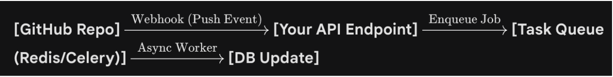

# Detect New Git Commits Webhook
Let the repository host (GitHub/GitLab) tell you when something changes.
1. The Trigger: GitHub Webhooks
You will register a Webhook on the repository. Listen for the push event.
    - Why: When a developer pushes code, GitHub instantly sends a POST request to your
backend with a JSON payload containing the list of added, modified, and removed files.
    - Optimization: This allows you to perform Incremental Updates. If a commit only touches
src/auth.py, you only need to "delete and re-populate" the ownership rows for
src/auth.py, leaving the rest of the database untouched.
2. The Architecture

Step-by-Step Flow:
1. Receive Event: Your API receives the push payload.
2. Filter: Parse the JSON to find the modified or added file paths. Ignore documentation or non-code files if desired.
3. Queue: For each relevant file, push a job to a message queue (e.g., "job: refresh_blame for src/YourFile.js").
Why a queue? If a huge commit touches 500 files, you don't want your API to hang while it processes them. You want to acknowledge the webhook immediately (200 OK) and process the data in the background.
4. Worker: The worker picks up the job:
    - Queries the GraphQL API for the specific file blame (using the query from your design doc 1).
    - Runs the resolve_overlaps logic we discussed.
    - Performs the DELETE FROM line_ownership WHERE file_path = ... and INSERT transaction.

## Deliverables
### A. Webhook Handler
Webhook handler written with Python/Flask

### B. Polling (The Fallback)
If you cannot set up webhooks (e.g., you don't have admin access to the repo or a public IP address), you must use Polling.
Logic: Run a script every X minutes that fetches the HEAD commit hash of the main branch.
Comparison: Compare it to the last hash you stored in your DB.
Diff: If they differ, use ```git diff <old_hash> <new_hash> --name-only``` (via API) to find which files changed, then trigger the same update pipeline as above.

